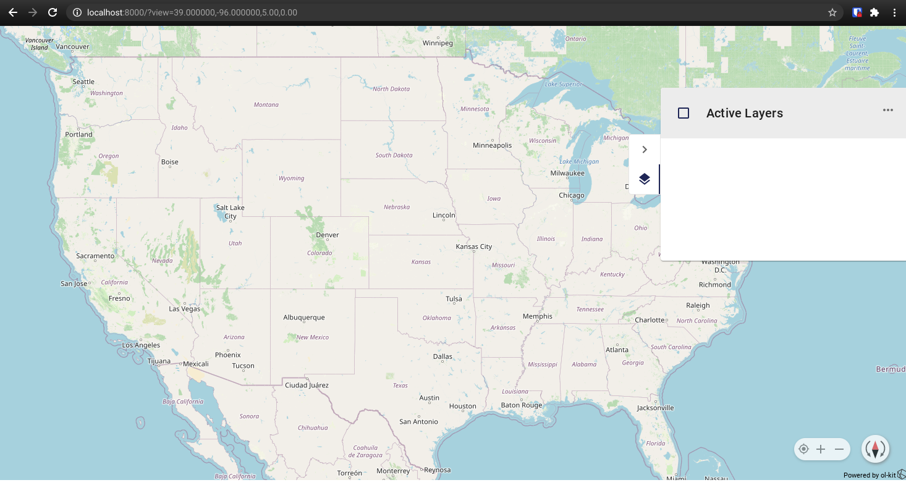

# docker-ol-kit
This container enables running a standalone ol-kit app with the ability to dynamically import layers from local files.  
 
## ol-kit docs
https://github.com/MonsantoCo/ol-kit  
 
## To run this image  
- docker run -p 8000:80 1904labs/ol-kit:latest  
 
## To build this image locally  
- clone this repository  
- docker build . -t ol-kit:latest  
- docker run -p 8000:80 ol-kit:latest  
 
## To run the ol-kit app via npm  
- install nodejs and npm  
- clone this repository  
- cd into the "app" directory  
- npm start  
 
## Interacting with the map  
If the image is not running launch it with  
```
docker run -p 8000:80 1904labs/ol-kit:latest  
```  
Once the image is running, to access the map open you browser and navigate to:
http://localhost:8000

You should see the map centered on the United States:  
  
 
 Next select the layers panel icon on the right side of the screen to open the layers panel  
  
 
 To import a layer first you will need something to import, for this example I downloaded these two files:
 - From: https://eric.clst.org/tech/usgeojson/
 https://eric.clst.org/assets/wiki/uploads/Stuff/gz_2010_us_040_00_500k.json  
 - From: https://datahub.io/core/geo-nuts-administrative-boundaries#data
  https://datahub.io/core/geo-nuts-administrative-boundaries/r/nuts_rg_60m_2013_lvl_1.geojson1  

Once you have those files (or any other geojson or kml files you wish to import), Click the three button menu in the layers panel and select import.  
  

After selecting import you can naviate in your computers file manager to the location you downloaded the files to and select the file gz_2010_us_040_00_500k.json, this will load the features layer to the map.
  

To zoom to the extent represented in the layer, click the three button menu next to that layer and select "Zoom to Layer Extent"
  

This should zoom you out to a view akin to this:
  

Now to add the second layer open the layer panel menu again and select import, navigate to where you downloaded the files to, and select the file "nuts_rg_60m_2013_lvl_1.geojson1", this should add the new layer to the map:
  

From here you can experiment with adding and removing any geojson or kml files that you have access to, there are plenty avaialble out on the web.